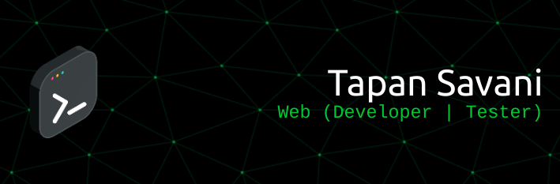

<!-- <h1>Tapan Savani</h1> -->

 

<h2>Languages I Know & Use</h2>
 
<!-- Python -->

<!-- Shell script -->

<!-- C++ -->

  

<h2>Services & Frameworks I Know & Use</h2>
 

 

<h2>Platforms used</h2>
 
<!-- Kali Linux -->

<!-- Ubuntu -->

<!-- Windows -->

 

<h2> Github Stat's </h2>
 
  

    
  

  

    
  

 

<h2> Get in Touch! </h2>
<!-- Portfolio -->

<!-- Twitter -->

<!-- Mail -->

<!-- LinkedIN -->

<!-- Instagram -->

